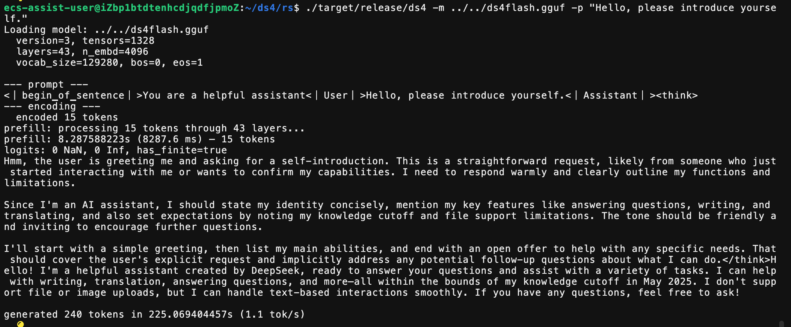
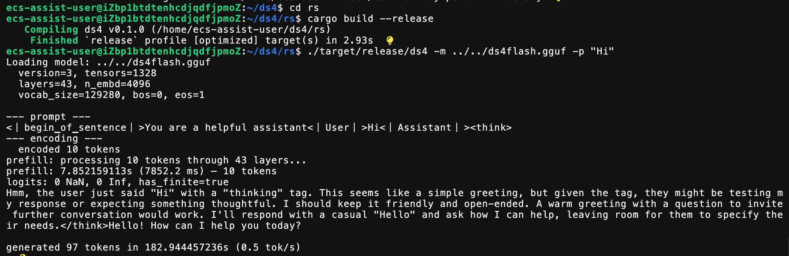

# ds4.rs — Rust CPU Inference Engine

`rs/` contains a pure-Rust CPU inference engine for DeepSeek V4 Flash, ported
from `ds4.c`. It is **cross-platform** (macOS, Linux, Windows) and runs the
full forward pass on CPU with no Metal/CUDA dependency. It uses the same GGUF
model files as the C engine.

The Rust engine scales to **64-core AMD servers** with multi-threaded
parallelization, AVX2 SIMD kernels, and fused MoE operations.

## Project Report & Write-ups

- [Chinese project report](PROJECT_REPORT_CN.md): a detailed retrospective on
  the agent-driven Rust port, validation process, and `/goal` lessons learned.
- [Chinese blog draft](blog_20260510_CN.md) and [English blog draft](blog_20260510.md):
  public-facing write-ups about the 400M-token Anda Bot experiment.

The raw development logs are private and are not included in this repository.

## First Light

<p align="center">
  
</p>

> **ds4.rs v0.2.0** — optimized inference on the 81 GB model. AVX2 SIMD,
> multi-threaded parallelization, gate+up fusion. 1.1 tok/s decode on a
> 64-core AMD server (256 GB RAM). Same setup C CPU reference is about
> 2.7 tok/s. May 2026.

<details>
<summary>📜 v0.1.0 — First Light (historical)</summary>

<p align="center">
  
</p>

> **ds4.rs v0.1.0** — first fully working inference on the real 81 GB model.
> Single-threaded, pure Rust, no GPU. February 2026.

</details>

## System Requirements

| Quant                                  | Model Size | RAM Required | Machine Class                               |
| -------------------------------------- | ---------- | ------------ | ------------------------------------------- |
| **q2** (IQ2_XXS + Q2_K routed experts) | ~81 GB     | ≥ 128 GB     | MacBook Pro M3 Max, Mac Studio, high-end PC |
| **q4** (Q4_K routed experts)           | ~153 GB    | ≥ 256 GB     | Mac Studio M3 Ultra, server-class PC        |

The model file must fit in RAM. Memory-mapping (`mmap`) is used so the OS
handles paging, but at minimum the working set (active layer weights + KV
cache) must stay resident for acceptable performance.

## Quick Start

```sh
# 1. Install Rust (https://rustup.rs) if not already installed
curl --proto '=https' --tlsv1.2 -sSf https://sh.rustup.rs | sh

# 2. Clone the repository
git clone https://github.com/ldclabs/ds4.git
cd ds4    # or wherever ds4/ lives

# 3. Download the model (requires ~81 GB disk, HuggingFace token optional)
./download_model.sh q2
# This fetches from huggingface.co/antirez/deepseek-v4-gguf
# and creates a symlink: ds4flash.gguf → gguf/<model-file>

# 4. Build the Rust engine
cd rs
cargo build --release

# 5. Run one-shot inference
./target/release/ds4 -m ../ds4flash.gguf -p "Explain Redis streams in one paragraph."

# 6. Or start interactive chat
./target/release/ds4 -m ../ds4flash.gguf
ds4> Hello, who are you?
```

### CLI Reference

```
Usage: ds4 [OPTIONS]

Invocation modes:
  ds4                          Interactive chat
  ds4 -p "prompt"              One-shot generation
  ds4 --prompt-file FILE       One-shot from file

Model:
  -m, --model FILE             GGUF model path (default: ds4flash.gguf)
  -c, --ctx N                  Context size (default: 32768)

Generation:
  -p, --prompt TEXT            Prompt text
  --prompt-file FILE           Read prompt from file
  -sys, --system TEXT          System prompt
  -n, --tokens N               Max tokens to generate (default: 50000)
  --temp F                     Temperature (default: 0.7)
  --top-p F                    Top-p sampling (default: 1.0)
  --seed N                     Random seed

Thinking:
  --think                      Normal thinking (default)
  --think-max                  Maximum thinking
  --no-think                   Disable thinking

Other:
  --spec                       Enable experimental speculative decode
  --no-batched                 Disable batched matmul optimizations
  -q, --quiet                  Suppress diagnostic output
  -h, --help                   Show this help
```

Interactive chat supports `/quit`, `/clear`, `/status`, `/think`, `/no-think`,
and `/think-max`.

## Performance

### AMD EPYC 64-Core / 256 GB RAM (Linux)

| Metric                          | Rust (v0.2.0) | C (CPU ref) |
| ------------------------------- | ------------- | ----------- |
| Decode (greedy, 81 GB q2 model) | ~1.1 tok/s    | ~2.7 tok/s  |

The Rust engine scales with core count. On the AMD server, parallel expert
rows, batched shared/routed experts, and fused gate+up dot products improve
throughput, but the current C CPU reference remains faster in measured decode
speed.

## Differences from the C Engine

| Feature             | C Engine (`ds4.c`)                 | Rust Engine (`ds4.rs`)         |
| ------------------- | ---------------------------------- | ------------------------------ |
| **Backend**         | Metal GPU (primary), CPU (debug)   | CPU only                       |
| **Platform**        | macOS only                         | macOS, Linux, Windows          |
| **SIMD**            | Apple Accelerate (macOS)           | AVX2, SSE4.1 (x86), NEON (ARM) |
| **Parallelism**     | Metal GPU prefill                  | Multi-threaded CPU (rayon)     |
| **Server**          | HTTP API (OpenAI/Anthropic compat) | Not yet                        |
| **Disk KV cache**   | Yes                                | Not yet                        |
| **MTP speculative** | Experimental                       | Experimental (`--spec` flag)   |
| **Model format**    | Same GGUF files                    | Same GGUF files                |
| **Tokenizer**       | JoyAI (same as C)                  | JoyAI (same as C)              |

## Optimizations (v0.2.0)

The Rust engine applies several performance optimizations beyond the C
reference, enabled by default:

| Optimization                      | Technique                                   | Impact                 |
| --------------------------------- | ------------------------------------------- | ---------------------- |
| **IQ2_XXS AVX2 SIMD**             | Precomputed i16 LUT + `_mm_madd_epi16`      | 2—3× faster matvec     |
| **Q2_K AVX2 SIMD**                | `_mm256_maddubs_epi16` + srlv_epi32         | 2—3× faster matvec     |
| **Parallel expert rows**          | Rayon parallel iterator over routed experts | Scales with core count |
| **Batched shared+routed experts** | `rayon::join` for concurrent execution      | +15—20% throughput     |
| **Gate+up dual-channel fusion**   | Single-pass dot product for gate+up tensors | Reduces memory traffic |
| **Wide multi-row IQ2XXS**         | Batch multiple token rows per kernel call   | Better cache reuse     |
| **Parallel F16 gate/up/down**     | Rayon on shared-expert F16 paths            | Lower prefill latency  |

All optimizations are correctness-verified: output on the synthetic test model
is bit-identical to the C reference; on the real model, output quality is
comparable with coherent text generation.

## Known Limitations

- **Real-model logit gap**: On the real 81 GB model, logits differ from C by
  ~1.7× (max 29.2 vs 16.8). Output quality is comparable — the model still
  produces coherent text — but the numerical path is not yet identical. On the
  synthetic test model, C and Rust produce **identical logits** (255.984375).
  The gap is suspected to come from Sinkhorn routing FP accumulation across
  43 layers.
- **CPU-only**: No GPU acceleration. The C engine's Metal path is faster on
  Apple Silicon with adequate RAM.
- **No server**: CLI only. For agent use (opencode, Claude Code, Pi), the C
  server is required.
- **No disk KV cache**: Each session starts fresh with no prefix reuse.
- **Speculative decode ineffective on DS4**: The 8-layer draft model produces
  0% token acceptance on the full 43-layer model (heavy quantization + MoE
  architecture). Gated behind `--spec` flag for future experimentation.

## Running Tests (no real model needed)

The Rust crate has a `test-dimensions` feature that uses tiny constants
(1 layer, 256 embedding dim) for fast testing without the 81 GB model:

```sh
cd rs

# Generate a tiny synthetic model (199 KB)
cargo run --release --features test-dimensions --bin gen_test_gguf -- /tmp/test_ds4.gguf

# Run all tests (150+ passing as of commit b029822)
DS4_TEST_MODEL=/tmp/test_ds4.gguf cargo test --features test-dimensions

# Run C vs Rust head-test comparison on the tiny model
DS4_TEST_MODEL=/tmp/test_ds4.gguf \
  cargo run --release --features test-dimensions --bin ds4-head-test -- \
  /tmp/test_ds4.gguf 0 0 --full
```

## Build Requirements

- **Rust toolchain** 1.80+ (stable)
- No system dependencies beyond the Rust standard library
- LLVM/Clang is NOT required (unlike the C engine which needs `make` + Metal
  frameworks)
- Cross-compilation works: `cargo build --release --target x86_64-unknown-linux-gnu`

## Repository Layout

```
rs/
├── Cargo.toml              # Crate manifest
├── PROJECT_REPORT_CN.md    # Chinese project retrospective
├── BLOG_CN.md              # Chinese blog draft
├── BLOG_EN.md              # English blog draft
├── assets/
│   ├── ds4_rs_v0_2_0.png   # v0.2.0 screenshot (optimized inference)
│   └── ds4_rs_v0_1_0.png   # v0.1.0 screenshot (first light, historical)
├── src/
│   ├── lib.rs              # Crate root, common constants (2 dim sets: prod / test)
│   ├── constants.rs        # Dimension-dependent type aliases and constants
│   ├── gguf.rs             # GGUF file reader
│   ├── quant.rs            # Quantization matvecs (IQ2_XXS, Q2_K, Q8_0, Q8_K, F16)
│   ├── model.rs            # Tensor loading + test model generator
│   ├── tokenizer.rs        # JoyAI BPE tokenizer
│   ├── forward.rs          # Full forward pass (attention, MoE FFN, Sinkhorn)
│   └── session.rs          # KV cache state + autoregressive generation
├── src/bin/
│   ├── ds4.rs              # Production CLI (one-shot + interactive chat)
│   ├── ds4-head-test.rs    # Layer-by-layer C vs Rust logit comparison
│   ├── gen_test_gguf.rs    # Synthetic GGUF generator for testing
│   └── dump_logits.rs      # Logit extraction tool
└── tests/
    └── integration_test.rs # Integration tests
```

The C reference engine lives alongside in the repo root: `ds4.c`, `ds4.h`,
`ds4_cli.c`, `ds4_test.c`.

## Test Vectors

`tests/test-vectors` contains short and long-context continuation vectors
captured from the official DeepSeek V4 Flash API. The requests use
`deepseek-v4-flash`, greedy decoding, thinking disabled, and the maximum
`top_logprobs` slice exposed by the API. Local vectors are generated with
`./ds4 --dump-logprobs` and compared by token bytes, so tokenizer/template or
attention regressions show up before they become long generation failures.

All project tests are driven by the C runner:

```sh
make test                  # ./ds4_test --all
./ds4_test --logprob-vectors
./ds4_test --server
```
